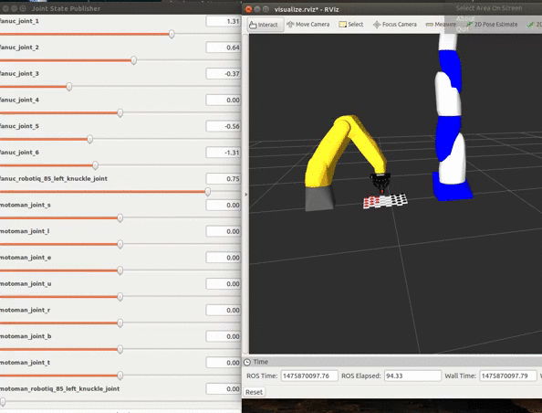

# Readme for Checkers Playing Robots in ROS
 
----

Michaloski, John L. 
Monday, March 27, 2017
CheckersReadme.docx

This document describes playing checkers using the Robot Operating System (ROS) as the robot control infrastructure.  Instead of using the ROS moveit package for motion control a combination of Gomotion trajectory generation based on robot kinematics described in URDF. The checkers demonstration is programmed using CRCL style commands that are programmed as C++ methods. Visualization is done using RVIZ (ROS Visualization) and [RVIZ makers](http://wiki.ros.org/rviz/DisplayTypes/Marker).
So far, besides using the core ROS tools, the following packages or code have been very useful:
 - David Lu arm_kinematics
 - Dave Coleman rvizvisualtools
 - Dave Hershberger, David Gossow, Josh Faust RVIZ

Checkers is useful in that it can demonstrate simple grasping using ROS. A Fanuc LR Mate 200 iD has a robotiq 2 finger gripper modeled in URDF in ROS and displayed in RVIZ. A simple bang-bang controller (no smooth trajectory motion) was initially used to move the checkers. Later the gomotion [gomotion](https://github.com/frederickproctor/gomotion) trajectory generation was extracted and mapped into a ROS  package that uses a tf  Pose, Quaternion and Vector as the main data structures.
Often the checker motions have a sloppy feel but it cuts down on the code size. Typically ROS moveit is used, but there are too many "moving parts" to easily integrate pick/place robotics.
Here is an animated gif of what is supposed to happen:

.


[Word2Markdown](https://github.com/johnmichaloski/SoftwareGadgets/tree/master/Word2Markdown)